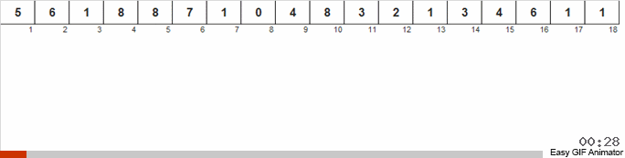

# Welcome, dear traveler

Ультимативное руководство по собеседованию для программиста Golang и не только. 

The Ultimate Interview Guide for a Golang programmer and more.

## Вопросы на собеседовании

- [Общие вопросы](#)

## Golang

### Тулинг (Tools)

-

### Модули и пакеты (Modules & Packages)

-

### Шедулинг и горутины (Shedule & Goroutines)

-

### Каналы и операции над нами (Channels)

- [Как на самом деле устроены каналы в Golang? | Golang channels internals](https://www.youtube.com/watch?v=ZTJcaP4G4JM)

### Контексты (Contexts)

-

### Массивы и слайсы (Arrays & Slices)

- [GoLang Slice в деталях, простым языком](https://www.youtube.com/watch?v=10LW7NROfOQ)

### Карты (Maps)

- [Хэш-таблицы за 10 минут](https://www.youtube.com/watch?v=0UX4MIfOMEs)
- [Как на самом деле устроен тип Map в Golang? | Golang под капотом](https://www.youtube.com/watch?v=P_SXTUiA-9Y)

### Интерфейсы и структуры (Interfaces & Structs)

- [Почему интерфейсы лучше размещать в месте использования - GoLang best practices](https://www.youtube.com/watch?v=eYHCCht8eX4)

### Ошибки и паники (Errors & Panics)

- 

### Отложенные вызовы (Deferer)

-

### Примитивы сихронизации (Sync primitives)

-

### Устройство строк, работа со строками (Strings in Golang)

-

### Сборщик мусора (Garbage Collector)

-

### Тесты (Tests)

- [Генерация и использование моков в Go / Mockery](https://www.youtube.com/watch?v=qaaa3RsC0FQ)

### Преимущества и недостатки языка Golang относительно других популярных языков (Advantages and disadvantages of the Golang language)

-

## Алгоритмы (Algorithms)

### Сортировки

**Почему их так любят на собеседованиях?**

Так работодатель преследует сразу несколько целей:

1. Если вам дана возможность выбрать любой алгоритм сортировки на своё усмотрение, вас проверяют на понимание работы алгоритмов и грамотный подход к решению.
2. Если вас просят реализовать конкретный алгоритм, делается упор на стиль написания кода.
3. Иногда для задачи даётся намеренно неправильный алгоритм, например такой, с которым сортировка займёт больше времени или памяти. Тогда вам нужно озвучить и аргументировать более выгодный вариант. Это продемонстрирует ваше умение анализировать задачу и отстаивать своё мнение.

Очень важно понимать механизм работы того или иного алгоритма. Допустим, быстрая сортировка предпочтительнее для массивов, а сортировка слиянием — для связных списков. Дело в том, что в связном списке для доступа к данным по индексу нужно пройти от головы до этого индекса. Сортировка слиянием обращается к данным последовательно, и потребность в произвольном доступе невелика.

**Ложка теории**

Сортировка данных — одна из алгоритмических категорий, к которым программисту следует привыкнуть. В первую очередь, конечно же, вы столкнётесь с сортировкой на этапе обучения. Задачи, где что-то нужно упорядочить по определённому признаку, — распространённая история, которая повторяется и на собеседованиях.

Сегодня существуют десятки алгоритмов сортировки. Прям на 100% одного идеального варианта нет: разные алгоритмы оптимальны для разных наборов и типов данных. Вы наверняка слышали или даже работали с самыми популярными из них:

1. Пузырьковая сортировка
2. Сортировка перемешиванием
3. Сортировка расчёской
4. Сортировка вставками
5. Сортировка выбором
6. Быстрая сортировка
7. Пирамидальная сортировка

Одни алгоритмы просты в реализации и хорошо подходят для разъяснения принципов сортировки, другие — для работы с большими массивами данных, третьи оптимизированы по числу процессорных циклов, скорости, etc.

Вот так, например, выглядят 15 Алгоритмов сортировки за 6 минут. [15 Алгоритмов сортировки за 6 минут (xkcdoff)](https://www.youtube.com/watch?v=rQtereWDc24)

Чтобы понять, зачем нужны алгоритмы сортировки, следует проанализировать хотя бы несколько из них. Рассмотрим наиболее популярные алгоритмы в коде и с кратким объяснением.

#### 1. Пузырьковая сортировка (Bubble sort)

Алгоритм состоит из повторяющихся проходов по сортируемому массиву. 
За каждый проход элементы последовательно сравниваются попарно и, если порядок в паре неверный, выполняется обмен элементов.
Проходы по массиву повторяются N-1 раз или до тех пор, пока на очередном проходе не окажется, что обмены больше не нужны, что означает — массив отсортирован. 
При каждом проходе алгоритма по внутреннему циклу, очередной наибольший элемент массива ставится на своё место в конце массива рядом с предыдущим «наибольшим элементом», а наименьший элемент перемещается на одну позицию к началу массива («всплывает» до нужной позиции, как пузырёк в воде — отсюда и название алгоритма).

Вот шаги для сортировки массива чисел от наименьшего к большему:

- __4 2__ 1 5 3: два первых элемента расположены в массиве в неверном порядке. Меняем их.
- 2 __4 1__ 5 3: вторая пара элементов тоже «не в порядке». Меняем и их.
- 2 1 __4 5__ 3: а эти два элемента в верном порядке (4 < 5), поэтому оставляем как есть.
- 2 1 4 __5 3__: очередная замена.
- 2 1 4 3 5: результат после одной итерации.

Для полной сортировки нужен еще один шаг. Третья итерация пройдет уже без замены. Так вы поймете, что массив отсортирован.

Но причём тут пузырьки? Посмотрите снова на пример, и вы увидите, что алгоритм как бы смещается вправо. По этому поведению элементов в массиве и возникла аналогия с «пузырьками», всплывающими на «поверхность».

##### Сложность

| Name                  | Best            | Average             | Worst               | Memory    | Stable    | Comments  |
| --------------------- | :-------------: | :-----------------: | :-----------------: | :-------: | :-------: | :-------- |
| **Bubble sort**       | n               | n<sup>2</sup>       | n<sup>2</sup>       | 1         | Yes       |           |

##### Реализация

```go
func BubbleSort(a []int) []int {
	for i := 0; i < len(a); i++ {
		for j := i + 1; j < len(a); j++ {
			if a[i] > a[j] {
				a[i], a[j] = a[j], a[i]
			}
		}
	}

	return a
}
```

```go
func BubbleSort(array []int) []int {
	changed := true
	length := len(array)

	// Массив в алгоритме считается отсортированным. При первой замене доказывается обратное и запускается еще одна итерация.
	// Цикл останавливается, когда все пары элементов в массиве пропускаются без замен
	for changed {
		changed = false

		for i := 1; i < length; i++ {
			// если порядок не верный
			if array[i-1] > array[i] {
				// меняем местами элементы
				array[i], array[i-1] = array[i-1], array[i]

				// продолжаем сортировку
				changed = true
			}
		}
	}

	return array
}
```

##### Визуализация


- Алгоритм хорошо себя показывает с большими наборами данных, где элементы почти отсортированы и требуется всего одна итерация, чтобы определить, отсортирован ли список до конца.
- В случае с совершенно неотсортированным списком, для пузырьковой сортировки он должен быть хотя бы небольшим.

#### 2. Сортировка вставками (Insertion sort)

Этот алгоритм разделяет оригинальный массив на сортированный и несортированный подмассивы.

Длина сортированной части равна 1 в начале и соответствует первому (левому) элементу в массиве. 
После этого остается итерировать массив и расширять отсортированную часть массива одним элементом с каждой новой итерацией.

После расширения новый элемент помещается на свое место в отсортированном подмассиве. 
Это происходит путём сдвига всех элементов вправо, пока не встретится элемент, который не нужно двигать.

В приведенном ниже массиве жирная часть отсортирована в порядке возрастания. Посмотрите что произойдет в этом случае:

- __3 5 7 8__ 4 2 1 9 6: выбираем 4 и помним, что это элемент, который нужно вставить. __8 > 4__, поэтому сдвигаем.
- __3 5 7 x 8__ 2 1 9 6: здесь x – нерешающее значение, так как элемент будет перезаписан (на 4, если это подходящее место, или на 7, если смещение). __7 > 4__, поэтому сдвигаемся.
- __3 5 x 7 8__ 2 1 9 6
- __3 x 5 7 8__ 2 1 9 6
- __3 4 5 7 8__ 2 1 9 6

Теперь вы видите, что отсортированная часть дополнилась элементом. Каждая следующая итерация делает то же самое, и к концу вы получите отсортированный массив!

##### Сложность

| Name                  | Best            | Average             | Worst               | Memory    | Stable    | Comments  |
| --------------------- | :-------------: | :-----------------: | :-----------------: | :-------: | :-------: | :-------- |
| **Insertion sort**    | n               | n<sup>2</sup>       | n<sup>2</sup>       | 1         | Yes       |           |

##### Реализация

```go
func InsertionSort(a []int) []int {
	j := 0
	for i := 1; i < len(a); i++ {
		temp := a[i]
		for j = i; j > 0 && temp < a[j-1]; j-- {
			a[j] = a[j-1]
		}
		a[j] = temp
	}
	return a
}
```

```go
func InsertionSort(array []int) []int {
	length := len(array)

	for i := 1; i < length; i++ {
		j := i

		for j > 0 {
			if array[j-1] > array[j] {
				array[j-1], array[j] = array[j], array[j-1]
			}
			j = j - 1
		}
	}

	return array
}
```

##### Визуализация


#### 3. Сортировка подсчетом

Сортируемые числа имеют диапазон возможных целых положительных значений, который достаточно мал по сравнению с сортируемым множеством. Например, миллион значений, каждое из которых не больше 1000.

##### Сложность

Время работы такого алгоритма составляет **O(U+N)**, где U
 - число возможных значений, N
 - число элементов в массиве.

Главная идея алгоритма — посчитать, сколько раз встречается каждый элемент в массиве, а потом заполнить исходный массив результатами этого подсчёта. Для этого нам нужен вспомогательный массив, где мы будем хранить результаты подсчёта. Даже если нам надо отсортировать миллион чисел, мы всё равно знаем диапазон этих чисел заранее, например, от 1 до 100. Это значит, что во вспомогательном массиве будет не миллион элементов, а сто.

В общем виде всё работает так:

1. Мы создаём вспомогательный массив и на старте заполняем его нулями.
2. Проходим по всему исходному массиву и смотрим очередное значение в ячейке.
3. Берём содержимое этой ячейки и увеличиваем на единицу значение вспомогательного массива под этим номером. Например, если мы встретили число 5, то увеличиваем на единицу пятый элемент вспомогательного массива. Если встретили 13 — тринадцатый.
4. После цикла во вспомогательном массиве у нас хранятся данные, сколько раз встречается каждый элемент.
5. Теперь мы проходим по вспомогательному массиву, и если в очередной ячейке лежит что-то больше нуля, то мы в исходный массив столько же раз отправляем номер этой ячейки. Например, в первой ячейке вспомогательного массива лежит число 7. Это значит, что в исходный массив мы отправляем единицу 7 раз подряд.

##### Зачем нужна эта сортировка

Допустим, у нас есть какой-то прибор, который выдаёт результаты в определённом диапазоне, например показывает сейсмоактивность этом регионе в диапазоне от 0 до 100. Он работает круглосуточно и каждые 2 секунды пишет в лог новое значение текущей активности землетрясений. За год получается 15 миллионов записей. Сортировка подсчётом отлично подходит для такого массива, потому что мы знаем диапазон и этот диапазон гораздо меньше общего количества элементов массива.

##### Реализация

```go
func CountingSort(a []int) []int {
	maxVal := 0
	for _, num := range a {
		if num > maxVal {
			maxVal = num
		}
	}

	b := make([]int, maxVal+1)
	for i := 0; i < len(a); i++ {
		b[a[i]]++
	}

	res := make([]int, 0, maxVal)
	for i := 0; i < len(b); i++ {
		for b[i] > 0 {
			res = append(res, i)
			b[i]--
		}
	}
	return res
}
```

##### Визуализация



#### 4. Быстрая сортировка

Быстрая сортировка относится к эффективным алгоритмам и состоит из нескольких шагов:

1. Из массива выбирается опорный элемент, чаще всего посередине массива.
2. Другие элементы массива распределяются таким образом, чтобы меньшие размещались до него, а большие — после.
3. Далее первые шаги рекурсивно применяются к подмассивам, которые разделились опорным элементом на две части — слева и справа от него.

##### Сложность

Сложность алгоритма: **O(n log n)**

- Быстрая сортировка считается самой быстрой, но она не всегда O(n log n), так как в худших случаях она становится О(n2).
- Быстрая сортировка более эффективна для наборов данных, которые помещаются в доступную память. Для больших наборов она неэффективна, и в этом случае более предпочтительна, например, сортировка слиянием.
- Быстрая сортировка — это сортировка на месте (т. е. она не требует дополнительной памяти), поэтому её целесообразно использовать для массивов.

##### Реализация

```go
func QuickSort(a []int, low, high int) {
	// завершить,если массив пуст или уже нечего делить
	if len(a) == 0 || low >= high {
		return
	}

	// выбираем опорный элемент
	middle := low + (high-low)/2
	middleVal := a[middle]

	// разделяем на подмассивы
	l, r := low, high
	for l <= r {
		for a[l] < middleVal {
			l++
		}

		for a[r] > middleVal {
			r--
		}

		// меняем местами
		if l <= r {
			a[l], a[r] = a[r], a[l]
			l++
			r--
		}
	}

	// рекурсия для сортировки левой и правой части
	if low < r {
		QuickSort(a, low, r)
	}
	if high > l {
		QuickSort(a, l, high)
	}
}
```

##### Визуализация


